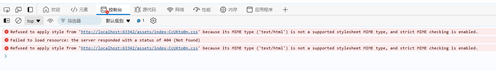
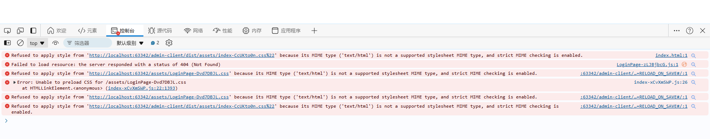

# Vant4打包后无法正常使用

## 1、无法使用状态

## 2、问题排查

### 1、样式引入错误

查询各种贴吧后认为是自动生成的index文件中样式引入书写错误。在idea中将其修改后，报错更多了初步排除这个错误情况。

### 2、修改了vite.config.js文件

想起来了在选择全局导入还是按需导入时犹豫了一下，在删除配置的时候不小心误删其他配置项的代码，导致输出的结果不对，然后将项目的代码进行比对之后发现并没有出现错误，排除。

### 3、Vant4打包方式与其他项目有差异

最后想到了这种情况，虽然可能性很小但是也只能试一试了。

没有翻到任何有区别的打包，但是之前我确实时运行起来了，我认为最大的问题还是在vant4上面，之前打包的elmentplus组件就没有出现这种情况。

### 4、路由的hash模式影响了使用

将webHash模式改成了web模式，尝试后完全没有效果，现在都有点想要放弃了，都是什么东西的破报错，讨厌死了.

## 最终解决方案

在vite.config.js文件中添加配置项base: './'，将路由方式改为hash模式。

